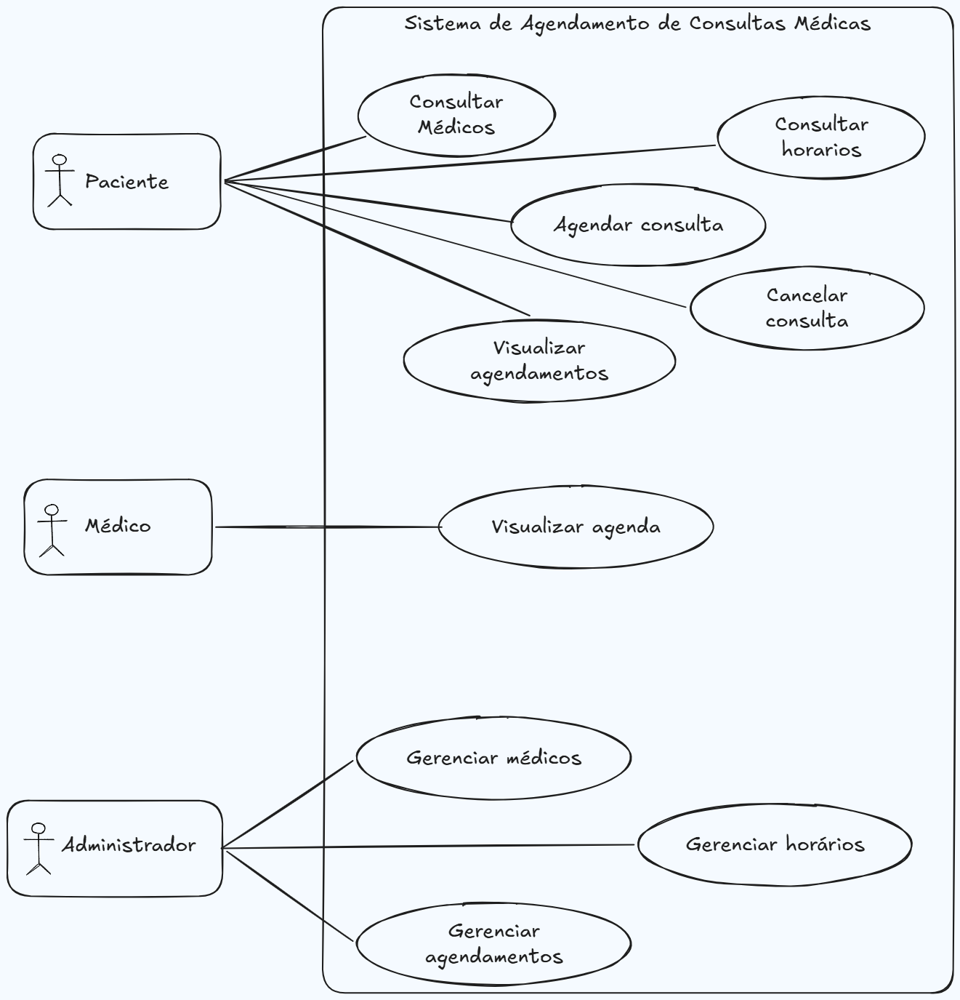

# Etapa 1 — Casos de Abuso e Modelagem de Ameaças com STRIDE

## Identificação do sistema

**Sistema:** Sistema de Agendamento de Consultas Médicas

**Integrantes:**
- Gustavo

**Repositório:** [https://github.com/GustavoOAlmeidz/trabalho-engenharia-software-seguro]

## Justificativa da escolha

O sistema foi escolhido por envolver diferentes perfis de usuários, troca de informações e operações relevantes para a segurança, como autenticação, acesso a informações pessoais, gerenciamento de consultas e controle de permissões.

Essas características permitem analisar diferentes tipos de ameaças e casos de abuso ao longo das etapas do trabalho.

## Descrição do sistema

O Sistema de Agendamento de Consultas Médicas permite que pacientes consultem médicos e horários disponíveis, realizem agendamentos e cancelem consultas.

Os médicos podem visualizar sua agenda e acompanhar as consultas marcadas.

Os administradores são responsáveis pelo gerenciamento de médicos, horários e agendamentos.

Durante essas operações, são utilizadas informações pessoais, credenciais de acesso e dados relacionados às consultas, que precisam ser considerados durante a análise de segurança.

## Usuários, ativos e pontos de interação

### Usuários e perfis de acesso

O sistema considera três perfis principais de usuários:

- **Paciente:** consulta médicos e horários disponíveis, realiza agendamentos, visualiza seus agendamentos e solicita cancelamentos.
- **Médico:** visualiza sua agenda e as consultas associadas ao seu atendimento.
- **Administrador:** gerencia médicos, horários disponíveis e agendamentos, possuindo acesso a funções administrativas do sistema.

### Ativos importantes

Os principais ativos identificados são:

- dados pessoais dos usuários;
- credenciais de acesso;
- informações relacionadas aos agendamentos;
- agenda e disponibilidade dos médicos;
- perfis e permissões de acesso;
- registros das operações realizadas no sistema.

Esses elementos são considerados importantes porque o acesso, alteração, exclusão ou indisponibilidade indevida pode comprometer a privacidade dos usuários e o funcionamento do serviço.

### Pontos de interação

Os principais pontos de interação considerados na análise são:

- cadastro e autenticação de usuários;
- consulta de médicos e horários;
- criação e cancelamento de agendamentos;
- visualização da agenda médica;
- operações administrativas de gerenciamento.

## Visão geral do fluxo

O paciente acessa o sistema para consultar médicos e horários disponíveis. Após selecionar uma opção, poderá realizar o agendamento de uma consulta ou cancelar um agendamento existente.

O médico utiliza o sistema principalmente para consultar sua agenda e visualizar as consultas programadas.

O administrador possui funções de gerenciamento, podendo administrar médicos, horários disponíveis e agendamentos.

Essa visão simplificada será utilizada como base para identificar os pontos em que ameaças de segurança podem ocorrer.

### Diagrama de casos de uso

## Modelagem de ameaças com STRIDE

A análise a seguir utiliza o modelo STRIDE para identificar ameaças relacionadas ao funcionamento do sistema.

| ID | Categoria STRIDE | Componente ou ativo | Ameaça identificada | Possível impacto |
|---|---|---|---|---|
| T01 | Spoofing | Conta de usuário | Um atacante obtém as credenciais de um paciente e acessa o sistema se passando por ele | Acesso indevido a dados pessoais, visualização e alteração de agendamentos |
| T02 | Tampering | Agendamento | Um usuário manipula uma solicitação para alterar ou cancelar um agendamento que não lhe pertence | Alteração indevida da agenda, perda de consultas e inconsistência das informações |
| T03 | Repudiation | Registro de operações | Um usuário realiza o cancelamento de uma consulta e posteriormente nega ter realizado a ação | Dificuldade de identificar o responsável e de investigar incidentes |
| T04 | Information Disclosure | Dados pessoais e consultas | Um usuário consegue visualizar informações de consultas pertencentes a outra pessoa | Exposição indevida de informações pessoais e violação de privacidade |
| T05 | Denial of Service | Serviço de agendamento | Um atacante envia grande quantidade de requisições para impedir ou degradar o acesso ao sistema | Indisponibilidade do serviço e impossibilidade de realizar ou consultar agendamentos |
| T06 | Elevation of Privilege | Perfis e permissões | Um paciente explora uma falha de autorização e consegue acessar funções reservadas ao administrador | Alteração de médicos, horários ou agendamentos sem autorização |
