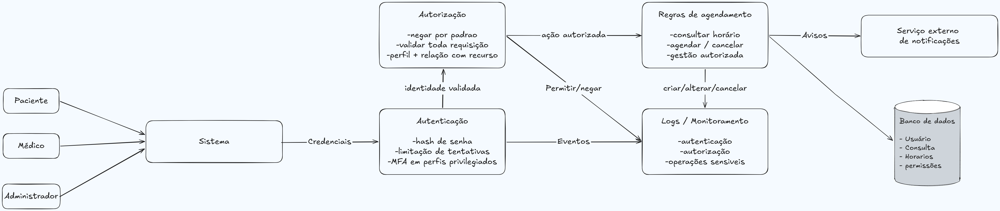

# Etapa 3 — Projeto de uma Arquitetura Segura

## Requisitos de segurança

Os requisitos de segurança foram derivados dos riscos prioritários identificados na Etapa 2.

Foram selecionados os riscos R01, R04 e R06 por apresentarem níveis crítico ou alto e estarem diretamente relacionados à autenticação, proteção de informações e controle de acesso.

| ID | Risco de origem | Requisito de segurança | Critério de verificação |
|---|---|---|---|
| RS01 | R01 | O sistema deverá limitar tentativas consecutivas de autenticação e bloquear temporariamente novas tentativas quando o limite definido for excedido | Após tentativas consecutivas malsucedidas acima do limite configurado, uma nova tentativa deverá ser temporariamente recusada e o evento deverá ser registrado |
| RS02 | R04 | O sistema deverá verificar se o usuário autenticado possui autorização para acessar cada informação de consulta ou agendamento solicitado | Uma tentativa de acessar informações pertencentes a outro usuário deverá ser recusada |
| RS03 | R06 | O sistema deverá validar no servidor o perfil e as permissões do usuário antes da execução de qualquer operação administrativa | Uma operação administrativa solicitada por um paciente ou médico sem permissão deverá ser recusada e registrada |

## Vulnerabilidades catalogadas

Para cada requisito de segurança foi identificada uma fraqueza relacionada no catálogo Common Weakness Enumeration (CWE).

| Risco | Requisito | Vulnerabilidade ou categoria | Referência utilizada | Relação com o sistema |
|---|---|---|---|---|
| R01 | RS01 | CWE-307 — Improper Restriction of Excessive Authentication Attempts | MITRE CWE | A ausência de limitação de tentativas pode permitir sucessivas tentativas de autenticação contra uma conta de usuário |
| R04 | RS02 | CWE-639 — Authorization Bypass Through User-Controlled Key | MITRE CWE | A manipulação do identificador de uma consulta ou agendamento pode permitir acesso a informações pertencentes a outro usuário caso a autorização não seja verificada |
| R06 | RS03 | CWE-862 — Missing Authorization | MITRE CWE | A ausência de verificação de autorização em uma operação administrativa pode permitir que usuários sem permissão utilizem funções privilegiadas |

## Arquitetura segura proposta

A arquitetura proposta posiciona os controles de autenticação e autorização antes da execução das regras de negócio e do acesso aos dados.

As operações relevantes também geram eventos para registro e monitoramento, permitindo posteriormente identificar comportamentos suspeitos e apoiar a investigação de incidentes.

### Diagrama da arquitetura

## Decisões de arquitetura

As decisões arquiteturais abaixo foram definidas a partir dos riscos prioritários e dos requisitos de segurança estabelecidos nesta etapa.

### DA01 — Limitação de tentativas de autenticação

| Campo | Descrição |
|---|---|
| Risco tratado | R01 — Acesso indevido à conta de um paciente |
| Decisão | O mecanismo de autenticação deverá controlar tentativas consecutivas malsucedidas e aplicar bloqueio temporário quando o limite configurado for excedido |
| Motivo | Permitir tentativas ilimitadas facilita ataques automatizados de adivinhação de credenciais |
| Componente afetado | Autenticação |
| Resultado esperado | Reduzir a possibilidade de comprometimento de contas por sucessivas tentativas de autenticação |

### DA02 — Autorização vinculada ao recurso solicitado

| Campo | Descrição |
|---|---|
| Risco tratado | R04 — Exposição indevida de informações |
| Decisão | Toda solicitação de acesso a consultas e agendamentos deverá verificar no servidor se o usuário possui permissão sobre o recurso solicitado |
| Motivo | Estar autenticado não significa possuir autorização para acessar recursos pertencentes a outros usuários |
| Componente afetado | Autorização e regras de agendamento |
| Resultado esperado | Impedir que a manipulação de identificadores permita acesso a informações pertencentes a terceiros |

### DA03 — Validação de permissões administrativas no servidor

| Campo | Descrição |
|---|---|
| Risco tratado | R06 — Acesso indevido a funções administrativas |
| Decisão | Todas as operações administrativas deverão validar o perfil e as permissões do usuário no servidor, adotando negação por padrão quando não existir autorização explícita |
| Motivo | Ocultar funções administrativas na interface não impede que um usuário tente acessar diretamente as operações protegidas |
| Componente afetado | Autorização |
| Resultado esperado | Impedir que pacientes ou médicos sem permissão executem funções administrativas |